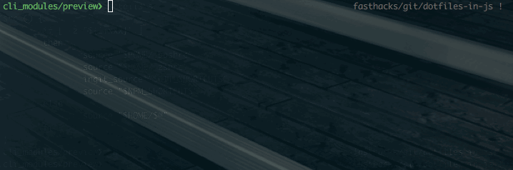
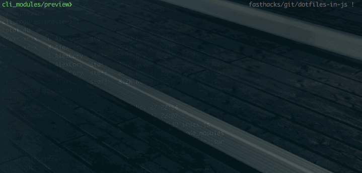
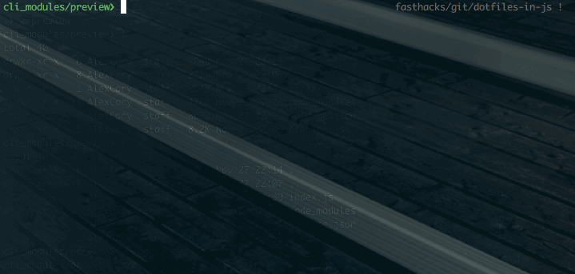
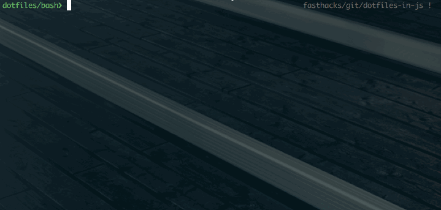
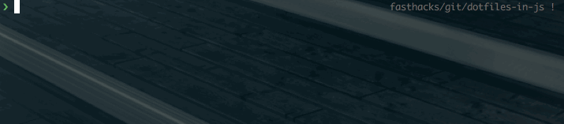

fast Hacks
==========

This project started out as a library of my notes, what I was currently learning, and what I wanted to learn. Now it has grown into a very useful tool as you can see below the things I am working on.

  
When you found out this actually existed.

Current Ideas/Commands/Features
--------------------------------

| Idea/Command/Feature | Description                                                                  | Status     |
| -------------------- | ---------------------------------------------------------------------------- | ----------- |
| `fh`                 | if no arguments are passed, shows a list maybe of what all fasthacks does    | Not Started |
| `t` or `task`        | todo app                                                                     | Not Started |
| `pathm`              | tool for helping you manage your machines `$PATH`.  Things often get lost, out of order, and it can be confusing to keep track of it all.  This will have a json file with all the paths in it call `paths.json`. | Not Started |
| `up`                 | an awesome update tool that will update all packages if no argument is specified. If a program/plugin/app is updated, it will update them reguardless of package manager | In Progress (sorta) |
| `help`               | universal help tool. (ex: help ruby, etc.) (may not be necessary)            | Not Started |
| `il`                 | install location - shows all the locations an app, program, etc. is installed on your computer. (i.e. checks to see if vim is installed aditionally by homebrew or elsewhere.) Can help solve dependency issues quicker.        | Not Started |
| `use`                | switch between versions of anything (ex: use ruby 2.1, use nodejs 3.7, etc.) | Not Started |
| `theme`              | switch between themes for everything in your terminal or specific programs.  | Not Started |
| `details`            | Similar to doing `which cmd` where `cmd` is a function or alias you have in your .bashrc or elsewhere.    Ex:    `$ details up`   `Description: Updates everything if no argumetns passed or updates the specified program.`   `Example: up vim`   `Location: .bashrc on line 21`   `Path: ~/.bashrc`   It's not complete, but here's where we're at currently.  | Started, but not even close |
| `edit`               | quickly edit your functions and aliases for your dotfiles.                   | Not Started |
| `cat`                | Colored `cat` output! The goal is for syntax highlighting!                   | Not Production Quality |
| `less`               | Colored `less` output! The goal is for syntax highlighting!                  | Not Production Quality |
| `man`                | Colored `man` pages! The goal is for syntax highlighting!    | Not Production Quality |
| `top`                | Colored `top`!  It uses a program called `htop` to do this currently with an alias in the `.bashrc`.   | Not Production Quality |
| `ssh`                | Setup default servers you go to the most so all you have to do is type `ssh` and boom presto shazam. | Done, needs reviews
| `pv` or `preview`    | Colored preview of file.  It also allows you to lookup what an alias or command does.  | Not Production Quality |
| `olss`               | Open last screen shot                                       | Needs Optimization & Testing |
| `path`               | Will probably eventually be replaced by `pathm`, but shows the $PATH in a prettier format.| Should Be Good |
| `src`                | Quick sourcing.  No more `source ~/.bashrc` etc, etc.  Just type `src` and it'll take care of the rest for you! You may also pass a path to it `src ~/.bashrc`. | Needs Review |
| `up` or `update`     | Allows anything to be updated with just one command.        | Started |
| `un` or `uninstall`  | Uninstalls the specified applications.                      | Started |
| `resymlink`          | You put all the absolute paths to your dotfiles with names, etc. into this `symlinks.json` file.  If something ever goes wrong, just type resymlink!                            | Started |
| `checksyms`          | Checks to see which symlinks are broken                     | Started |
| `clrs` or `colors`   | Spits out colors and codes.                                 | Done |
| `chide`              | Hides the specified app from the `command + tab` window.    | Works on Mavericks, but trouble on Yosemite. Can cause some apps to crash. |
| `cshow`              | Unhides hidden application from the `command + tab` window. | Works on Mavericks, but trouble on Yosemite |
| `show`               | Shows all your hidden dot files.                            | Done |
| `hide`               | Re-hides all your hidden dot files.                         | Done |
| `most`               | Displays a lit of your most used commands.                  | Done |
| `zsh-syntax-highlighting` | Colors your command green if it's valid and red if it won't work.  | Done |

Theme
-----
#### Usage:
 - ToDo

#### Resources:
 - [Terminal Color Scheme Designer](http://ciembor.github.io/4bit/#)
 - [Make a Terminal prompt](http://bashrcgenerator.com/)
 - [Beautify Logfile Commands](http://korpus.juls.savba.sk/~garabik/software/grc.html)
 - [A Stylesheet author's guide to terminal colors](http://wynnnetherland.com/journal/a-stylesheet-author-s-guide-to-terminal-colors/)

Task ([Taskwarior](http://taskwarrior.org/tools/))
----

#### Usage:
 - It's an amazing todo program for the console.
 
#### Resources
 - 
 
#### Great Taskwarior Extensions
 - [taskopen](https://github.com/ValiValpas/taskopen): Script for taking notes and open urls with taskwarrior.
 - [tasknc](https://github.com/flickerfly/taskwarrior-notifications): A collection of ways to alert me/bring attention to my task list because I'm easily distracted and need help focusing.
 - [taskwarrior-time-tracking-hook](https://github.com/kostajh/taskwarrior-time-tracking-hook): A simple Taskwarrior hook allowing one to track total time spent on a task.
 - [taskwarrior-web](http://theunraveler.com/taskwarrior-web/): Web interface

ToDo's
------
- [ ] Install Script
- [ ] Website + documentation
- [ ] [alias-tips](https://github.com/djui/alias-tips)
- [ ] [zsh completions](https://github.com/zsh-users/zsh-completions)
