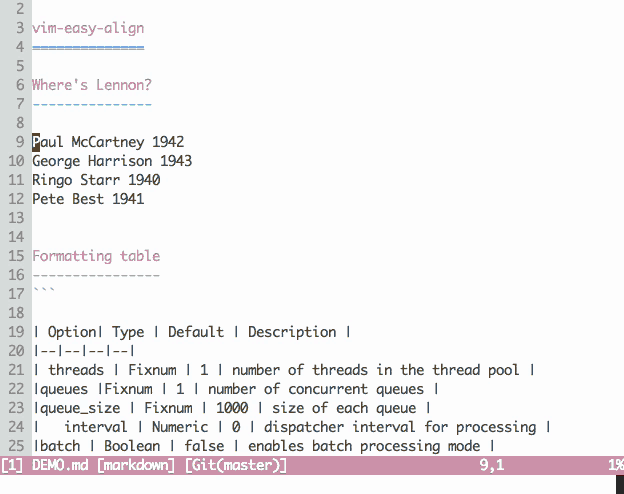
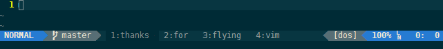
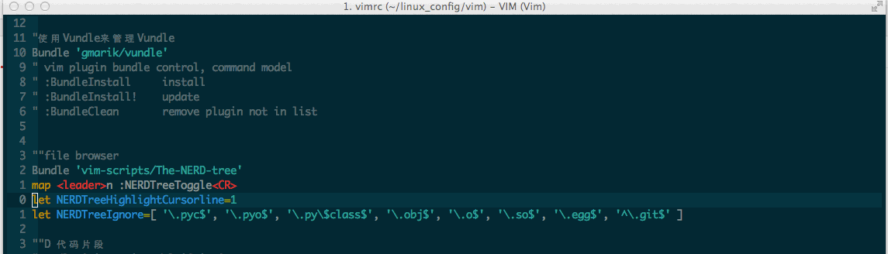
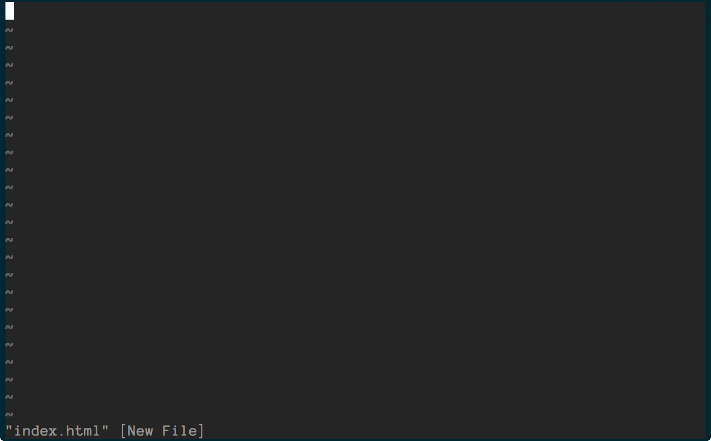
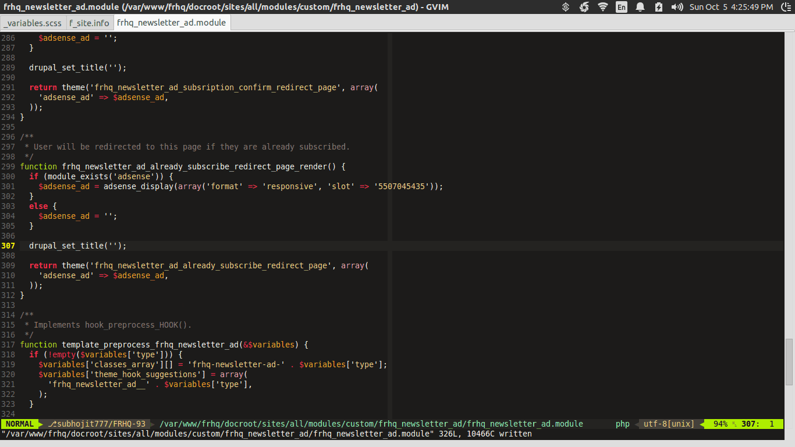
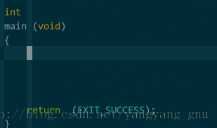
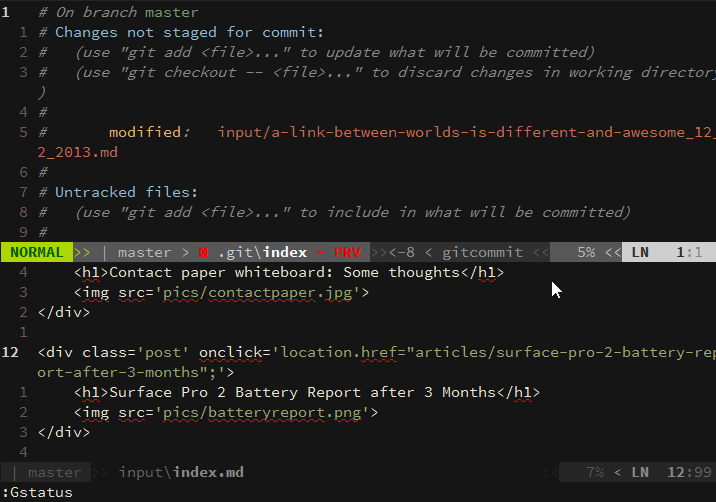
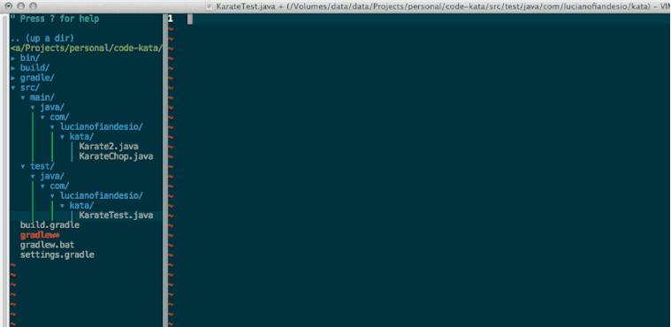

**        .__                       **
**  ___  _|__| ____________   ____  **
**  \  \/ /  |/     \_  __ \_/ ___\ **
**   \   /|  |  Y Y  \  | \/\  \___ **
**  /\\_/ |__|__|_|  /__|    \___  >**
**  \/             \/            \/ **

##### These are a list of cool things I have either thought up and put in my .vimrc, or just cool things I've gathered along the way.

### Function Shortcuts
(Only work if you have curley braces with your functions)
`cif` Change in function
`caf` Change around function
`cn`  Change function name
`cr`  Change function args

`dif` Delete in function
`daf` Delete around function
`dn`  Delete function name
`dr`  Delete function args

`vif` Visually Select in function
`vaf` Visually Select around function
`vn`  Visually Select function name
`vr`  Visually Select function args

### Misc
`gp OR vp` Visually Select Most Recently Pasted Text
`gv` Visually select most recently visually selected text
`12<space>` Takes you to line 12

### Commenting
`gcc` Comment/Uncomment Selection or Line
`gci` Comment inline
`gcr` Comment from current position to end of line
`gcb` Block Comment (aka. `sexy comments`)
`gcp` Comment Paragraph

### File/Pane Editing
(comma is my leader key)
`,a` Quick save all files
`,w` Quick write and quit a file
`,q` Quit file (equivalent to :q<enter>)
`,t` Open new vim vertical split pane (what I think of as a split tab)

# Aligning
(uses Tabularize package)
`,,`  Aligns surrounding lines based off of commas
`,=`  Aligns surrounding lines based off of equals
`,;`  Aligns surrounding lines based off of colons
`,;;` Aligns surrounding lines based off of 2 colons

# File Searching
`ctrl+p` Control P file search
` \ `    Silver Searcher (allows you to search all files for specific search term)
`,/`     Search and replace current file (usage: ,/    =>   :%s/searchFor/replaceWith/gc)

# My Favorite Plugins

## Tabular
Summary: Quickly aligns code based off of `=, commas, pipes, colons, semicolons`
[Details](http://vimawesome.com/plugin/tabular)
[Video](http://vimcasts.org/episodes/aligning-text-with-tabular-vim/)

## Easy Align
(I'm probably soon going to switch to this because it is better maintaned)
Summary: Quickly aligns code based off of `=, commas, pipes, colons, semicolons`
[Details](http://vimawesome.com/plugin/vim-easy-align)

## CSS Colors
Summary: Preview colors in source code while editing
[Details](http://vimawesome.com/plugin/vim-css-color-the-story-of-us)

## Vim Airline
Summary: Status tabline at the bottom of vim.
[Details](http://vimawesome.com/plugin/vim-airline-sad-beautiful-tragic)

## Surround
Summary: Allows you to quickly surround pieces of text.
[Details](http://vimawesome.com/plugin/surround-vim)

## Repeat
Summary: Allows all your plugins to be repeated with `.`
[Details](http://vimawesome.com/plugin/repeat-vim)

## Ctrl P
Summary: Full path fuzzy file, buffer, mru, tag, ... finder for Vim.
[Details](http://vimawesome.com/plugin/ctrlp-vim-state-of-grace)

## Nerd Tree
Summary: A file tree explorer plugin. Think of it as the sidebar of a text editor/IDE.
[Details](http://vimawesome.com/plugin/the-nerd-tree)

## Emmet
Summary: Super fast html & css coding. Also really great shortcuts.
[Details](http://vimawesome.com/plugin/emmet-vim)

## Syntastic
Summary: Syntax check.  Shows the lines that are currently messed up.
[Details](http://vimawesome.com/plugin/syntastic)

## SuperTab
Summary: Vim completions with tab.
[Details](http://vimawesome.com/plugin/supertab)

## Vim-Fugitive
Summary: a git wrapper so awesome it should be illegal.
[Details](http://vimawesome.com/plugin/vim-fugitive)

## Ultisnips
Summary: File path completion and snippets.
[Details](http://vimawesome.com/plugin/ultisnips-forever-and-always)

## Autoclose
Summary: Autoclose characters for you, like (), {}, []
[Details](http://vimawesome.com/plugin/vim-autoclose-sparks-fly)

## Undotree
Summary: Shows edit history up to the second of a file.
Similar Plugins: [Gundo](http://vimawesome.com/plugin/gundo)
[Details](http://vimawesome.com/plugin/undotree-vim)

## tComment
Summary: an extensible & universal comment vim-plugin that also handles embedded filetypes.
[Details](http://vimawesome.com/plugin/tcomment)

## Dash
Summary: Quickly see documentation for a fuction your cursor is currently on
[Details](http://vimawesome.com/plugin/dash-vim)

## Vim Markdown
Summary: Syntax highlighting and shortcuts while working on markdown.
[Details](http://vimawesome.com/plugin/markdown-syntax)

## Unimpaired
Summary: Quick mappings such as `>p` (to indent paste) and `=p` (to properly align paste)
[Details](http://vimawesome.com/plugin/unimpaired-vim)

## Matchit
Summary: Extends the `%` (aka matching `{}, [], (), etc`) so it will match opening and closing html tags and more.
[Details](http://vimawesome.com/plugin/matchit-zip)

